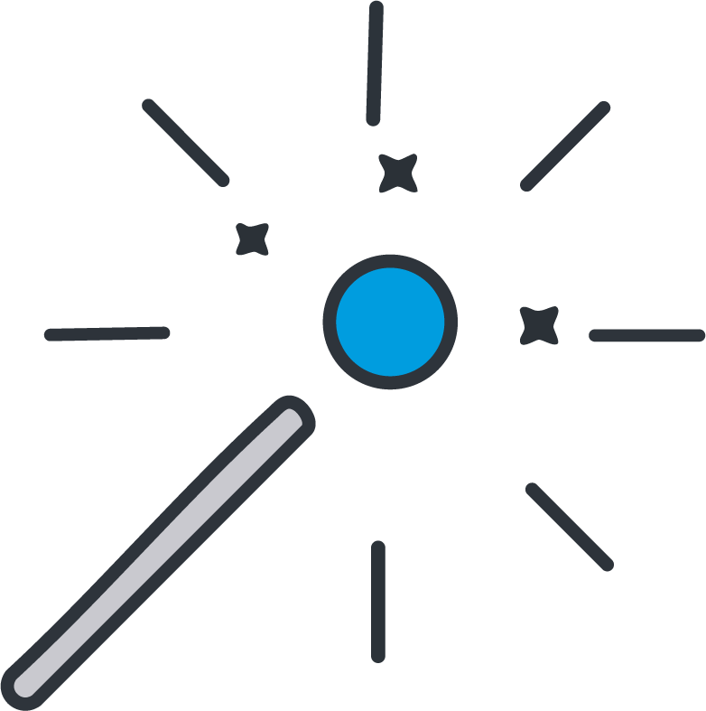

<p align="center">
    <a href="https://github.com/LucaCDRocha/magic-escape-vr">
        
    </a>
    x
    <a href="https://github.com/Chabloz/a-frame-vite-vue-boilerplate">
        
    </a>
</p>
<h1 align="center">Magic escape VR</h1>

<p align="center">
    
    
    
    
</p>

<p align="center">
    <a href="https://magic-escape.luca-cdrocha.ch/">>> DEMO <<</a>
</p>

---

This is a VR escape room game made with A-Frame. The game is a simple escape room where you have to explore the rooms and change the colors of the lights to find clues and solve the puzzles to escape.

## Interaction support

- **Desktop** – Aim with the cursor and click left to interact with objects. For changing room color use right click and move the wand in the direction of a color
- **VR/AR** – Use the tip of the wand to interact with objects. For changing room color press any button of the right controller and touch a color with the tip of the wand

## Movement modes support

- **Desktop** – Keyboard for move (_WASD_ or Arrows keys) + Mouse for look control (Drag and drop)
- **Mobile** – 1x Finger touch to go forward + 2x Fingers touch to go backward + Gaze cursor for click
- **VR/AR** – walk + Teleport (Grip for grab and laser for click) + Gaze cursor for click in AR

---

## Quickstart

### Create a folder for your project and move to it

### Clone (or fork, or download)

```sh
git clone https://github.com/LucaCDRocha/magic-escape-vr.git .
```

### Install dependencies

```sh
npm ci
```

### Dev

```sh
npm run dev
```

### Build

```sh
npm run build
```

## Notes for local dev on VR headset

1. Check that your development device and your VR headset are connected on **the same network**.

2. Expose you local development:

```sh
npm run dev-expose
```

3. In your VR headset, browse to the local development adress `[ip]:[port]`.

> [!NOTE]
> The certificate is self-signed, so you will probably have to confirm access to the resource in your browser.
